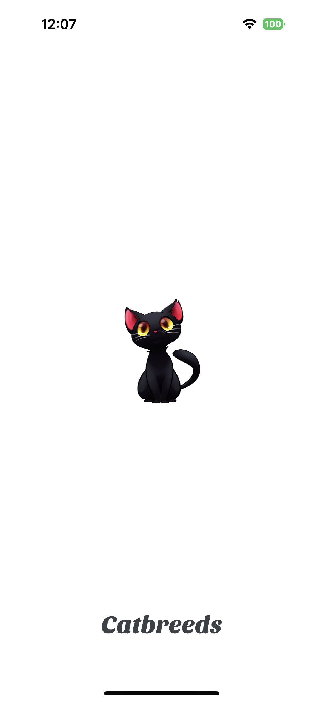
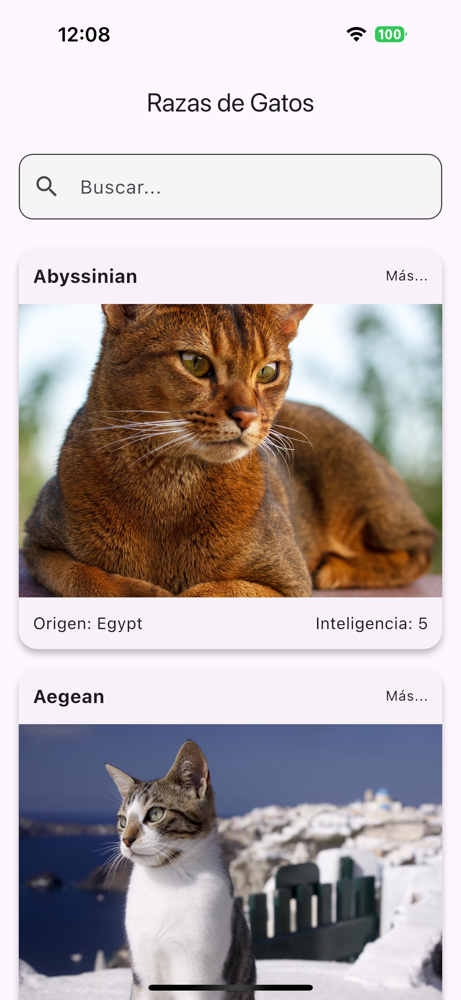
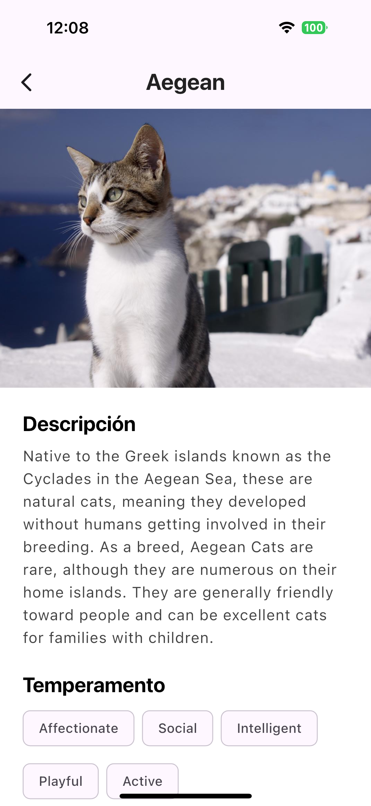
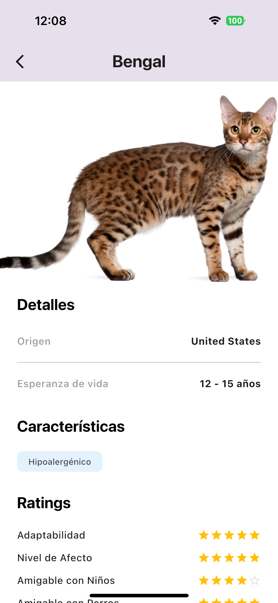

# 🐱 CatBreeds - Pragma Technical Test


Aplicación móvil profesional desarrollada en Flutter que permite explorar razas de gatos, buscar
información detallada y visualizar características específicas,
consumiendo [TheCatAPI](https://developers.thecatapi.com/view-account/ylX4blBYT9FaoVd6OhvR?report=bOoHBz-8t).

> **Nota:** Proyecto desarrollado como parte del proceso de selección para el rol de **Desarrollador
Mobile Flutter Senior** en Pragma.

## 📱 Screenshots

<div style="display: flex; flex-direction: row; gap: 10px; overflow-x: auto;">
  
  
  
  
</div>

---

## 🚀 Características Principales

Esta aplicación fue construida siguiendo estrictos estándares de calidad, escalabilidad y
mantenibilidad.

### Arquitectura & Diseño

* **Clean Architecture (Feature-first):** Separación estricta de responsabilidades en capas (
  `Domain`, `Data`, `Presentation`) organizada por funcionalidades en `lib/features`.
* **Solid Principles:** Aplicación de principios SOLID para un código robusto y mantenible.
* **Diseño Atómico:** Componentes de UI modulares y reutilizables bajo la estructura de Atomic
  Design (Molecules, Organisms).
* **Slivers & Custom UI:** Experiencia de usuario inmersiva con efectos de desplazamiento avanzados
  y cabeceras colapsables.
* **Paginación Optimizada:** Implementación de *infinite scrolling* eficiente que carga datos bajo
  demanda, optimizando el consumo de memoria y reduciendo la latencia de red.
* **Internacionalización (l10n):** Soporte completo para **Inglés** y **Español** configurado en
  `lib/l10n`.

### Técnica & Funcionalidad

* **State Management (Riverpod v2):** Gestión de estado reactiva, segura y testable con
  `riverpod_generator`.
* **Dependency Injection:** Inyección de dependencias desacoplada usando `GetIt` e `Injectable`.
* **Offline-First:** Persistencia de datos local robusta utilizando **Drift** (SQLite) con
  encriptación (`sqlcipher`) para seguridad de datos sensibles.
* **Network Layer:** Cliente HTTP **Dio** configurado con interceptores, manejo de tiempos de espera
  y transformación de errores a excepciones de dominio customizadas (`ApiFailure`).
* **Caching Inteligente:** Cacheo de imágenes con `cached_network_image` y almacenamiento local de
  respuestas API.
* **Seguridad:** Uso de `flutter_secure_storage` para datos sensibles y claves.
* **Testing:** Cobertura de pruebas unitarias y de widgets (`mocktail`, `flutter_test`).

---

## 🛠️ Stack Tecnológico

| Categoría | Tecnología/Librería | Propósito |
|:--- |:--- |:--- |
| **Lenguaje** | Dart 3.x | Tipado fuerte, null-safety, records, patterns. |
| **Framework** | Flutter 3.38.5 | Version recomendada, gestionada via **FVM**. |
| **Estado** | **Riverpod + Hooks** | Gestión de estado y reactividad. |
| **DI** | **GetIt + Injectable** | Service Locator y Generación de código para DI. |
| **Red** | **Dio** | Cliente HTTP potente con Interceptores. |
| **BD Local** | **Drift + SQLCipher** | Base de datos relacional tipada y segura. |
| **Funcional** | **Dartz** | Programación funcional (`Either` para manejo de errores). |
| **Modelos** | **Freezed + JsonSerializable** | Data classes inmutables y serialización. |
| **Utils** | **Flutter Dotenv** | Manejo de variables de entorno. |

---

## 🏗️ Arquitectura del Proyecto

El proyecto sigue una estructura **Clean Architecture** orientada a **Features**, promoviendo la
modularidad y facilitando el trabajo en equipo.

```text
lib/
├── app/                    # Configuración inicial de la App (MaterialApp, Theme)
├── config/                 # Rutas, Constantes, Environment
├── core/                   # Shared Kernel (Errores, Network, Utils, Database global)
├── di/                     # Configuración de Inyección de Dependencias
├── features/               # Módulos funcionales (e.g., CatBreeds)
│   └── cat_breeds/
│       ├── data/           # Implementación (Repositorios, Datasources, Modelos)
│       ├── domain/         # Reglas de Negocio (Entidades, Interfaces, Casos de Uso)
│       └── presentation/   # UI & Estado (Providers, Screens, Widgets)
├── l10n/                   # Archivos de internacionalización (.arb)
├── main_dev.dart           # Entry point Flavor DEV
├── main_prod.dart          # Entry point Flavor PROD
└── main.dart               # Entry point default
```

---

## ⚡ Configuración y Flavors

El proyecto maneja múltiples entornos (Flavors) para separar configuraciones de desarrollo y
producción.

### Flavors Disponibles

1. **Development (`dev`):** Conecta a entornos de prueba, logs detallados activados.
    * **Entry Point:** `lib/main_dev.dart`
2. **Production (`prod`):** Optimizado para store, logs desactivados, datos reales.
    * **Entry Point:** `lib/main_prod.dart`
3. **Pre-Production (`pre`):** Entorno de staging (opcional según configuración).
    * **Entry Point:** `lib/main_pre.dart`

---

## ⚙️ Setup e Instalación

### Prerrequisitos

* **Flutter SDK:** Versión **3.38.5** (Requerida).
* **(Opcional) FVM:** Se incluye configuración en `.fvmrc` para quienes usan Flutter Version
  Management.
* **IDE:** VS Code o Android Studio con plugins de Flutter y Dart.
* **Java JDK 17:** Requerido para builds de Android recientes.

### Pasos

1. **Clonar el repositorio:**
   ```bash
   git clone <url-del-repo>
   cd cat_breeds
   ```

2. **Instalar Flutter (Opcional si usas FVM):**
   ```bash
   fvm install
   ```
   > **Nota:** Si decides usar **FVM**, recuerda anteponer `fvm` a todos los comandos (ej:
   `fvm flutter pub get`).

3. **Instalar dependencias:**
   ```bash
   flutter pub get
   ```

4. **Configurar Variables de Entorno (.env):**
   Crea un archivo `.env` en la raíz del proyecto basándote en el template `.env.example`.
   ```bash
   cp .env.example .env
   ```
   Edita el archivo `.env` y agrega tu API Key real:
   ```properties
   THE_CAT_API_KEY=tu_api_key_real_generada_en_thecatapi
   ```

5. **Generar Código (Build Runner & l10n):**
   Este proyecto usa generación de código extensiva.

   *Traduciones (l10n):*
   ```bash
   flutter gen-l10n
   ```

   *Riverpod, Freezed, Drift, Injectable:*
   ```bash
   # Build único
   dart run build_runner build --delete-conflicting-outputs
   
   # Modo Watch (Desarrollo)
   dart run build_runner watch --delete-conflicting-outputs
   ```

6. **⚠️ Configuración de Android (Key.properties):**
   Para generar builds de **Release** (APKs, Bundles), el proyecto requiere un archivo
   `android/key.properties` para la firma.

   > Si solo ejecutas en modo Debug, puedes omitir este paso.

   Crea `android/key.properties` con tus credenciales de keystore local:
   ```properties
   storePassword=<password>
   keyPassword=<password>
   keyAlias=<alias>
   storeFile=<path_to_keystore.jks>
   ```
   > En CI/CD (GitHub Actions), este archivo se genera automáticamente usando Secretos.

7. **Ejecutar la App:**
   ```bash
   flutter run -t lib/main_dev.dart --flavor dev
   ```

---

## 🎨 Generación de Assets

### Iconos de App

```bash
flutter pub run flutter_launcher_icons:main -f flutter_launcher_icons*
```

### Splash Screen

```bash
dart run flutter_native_splash:create --flavors dev,pre,prod
```

---

## 📦 Comandos de Build y Distribución

Para generar artefactos listos para distribución (Release), asegúrate de usar el flag `--release`.

### Android

```bash
# Generar APK (Dev Release)
flutter build apk --flavor dev -t lib/main_dev.dart --release

# Generar AppBundle (Prod Release - Play Store)
flutter build appbundle --flavor prod -t lib/main_prod.dart --release
```

### iOS

```bash
# Generar IPA (Prod Release - App Store)
flutter build ipa --flavor prod -t lib/main_prod.dart --export-options-plist=ios/ExportOptions.plist --release
```

---

## 🤖 CI/CD Workflows

Se han configurado flujos de trabajo en **GitHub Actions** para automatizar la integración y entrega
continua.

* **`develop_deploy.yml`**: Push a `develop`. Ejecuta tests y genera **Dev Release** (APK/Bundle).
* **`master_deploy.yml`**: Push a `master`. Ejecuta tests y genera **Prod Release** (AppBundle).

> Los workflows se encargan de inyectar las variables de entorno y las llaves de firma de forma
> segura.
